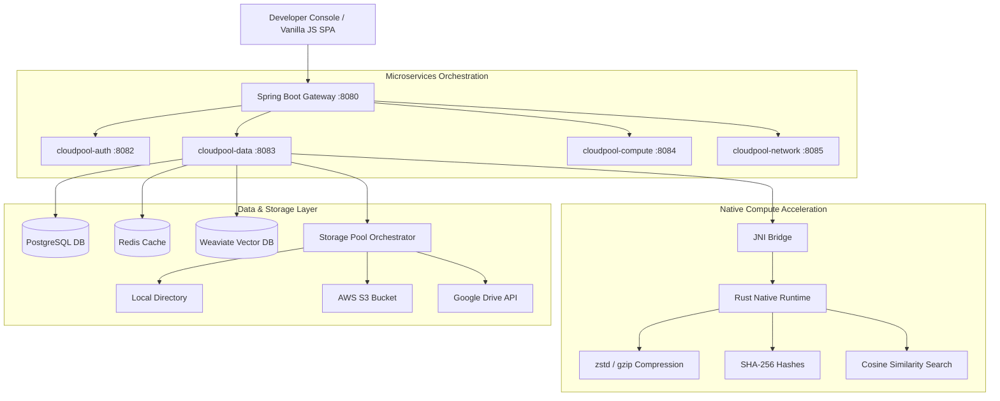
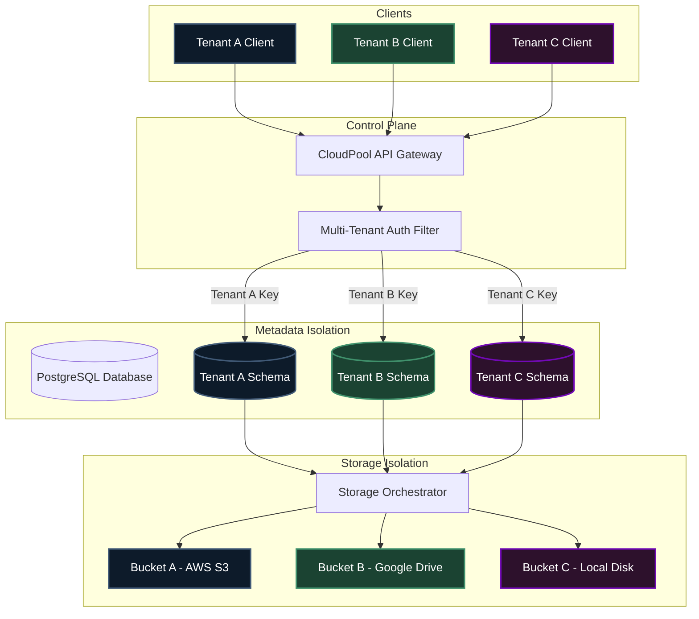
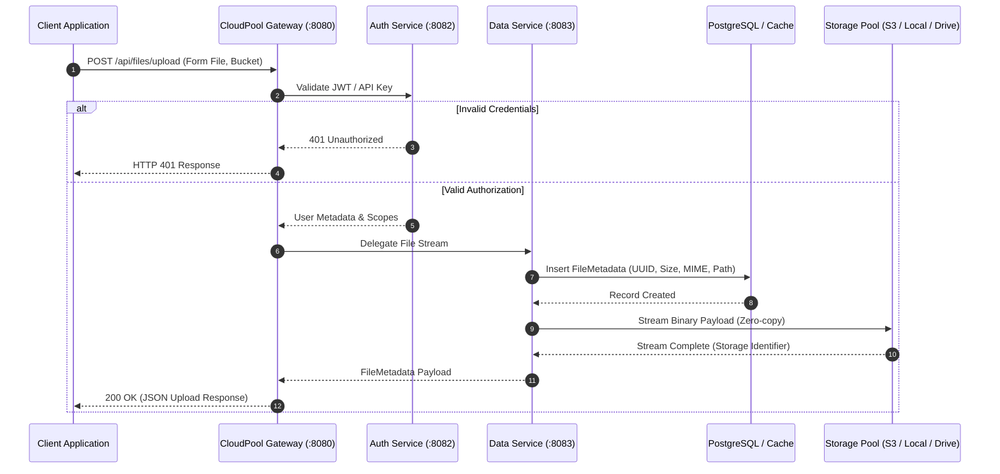

<div align="center">
  <h1>CloudPool</h1>
  <p><strong>Developer Infrastructure Orchestration & Decentralized BaaS Platform</strong></p>
  
  [](LICENSE)
  [](https://java.com/)
  [](https://www.rust-lang.org/)
  [](https://spring.io/projects/spring-boot)
  [](https://graphql.org/)
  [](https://www.postgresql.org/)
  [](https://weaviate.io/)
</div>

<br>

<div align="center">
  <!-- Hero Banner -->
  
  <p><em>Figure 1: CloudPool Developer Console Dashboard (Metrics, Storage, and Infrastructure State)</em></p>
</div>

---

## 🌩️ Overview

CloudPool is an open-source **Developer Infrastructure Orchestration & Decentralized BaaS Platform** designed to unify backend services into a single programmable infrastructure layer. 

Rather than replacing existing cloud providers, CloudPool orchestrates and abstracts infrastructure components through a centralized control plane capable of database provisioning, hybrid storage pooling, vector search indexing, state auditing, and native JNI-accelerated computations.

---

## 📸 Quick Platform Demo
If you want to view a walkthrough of the system running, check out the walkthrough GIF below:
*(For instructions on capturing your own, refer to the [Screenshot Capture Guide](docs/SCREENSHOTS_GUIDE.md))*

<div align="center">
  
</div>

---

## ✨ Core Features

* **Infrastructure Orchestration**: Dynamic PostgreSQL schema generation, Redis cache management, and multi-tenant database partitions.
* **Hybrid Storage Pooling**: Unifies Local Directories, AWS S3, and Google Drive behind a single zero-copy file controller.
* **Native Rust Performance Layer**: High-speed compression, hashing, and vector math operations bridged to the JVM via JNI.
* **Dynamic Provisioning Engine**: Exposes raw table creation, live updates, and live schema rollbacks via REST and GraphQL.
* **Embedded Vector Search**: Embedded Weaviate engine with native fallback capabilities for semantic and hybrid similarity search.
* **API Key Management**: Granular developer keys with token-scoped security configurations, expiration times, and live revocation.

---

## 🏛️ Platform Architecture & Flows

CloudPool separates high-level orchestration logic (JVM/Spring Boot) from performance-critical compute tasks (Rust via FFI).

### 1. System Topology

<div align="center">
  
</div>



---

### 2. Multi-Tenant Isolation Flow
This diagram details the logical segmentation that ensures Tenant A, Tenant B, and Tenant C remain isolated across credentials, schemas, and backing storage.



---

### 3. File Upload Flow Diagram
Detailed request lifecycle tracing validation, metadata cataloging, and physical file stream dispatch to the target storage adapter.



---

## 🖼️ Developer Console screenshots

The interface consists of specialized pages for storage configuration, metrics visualization, database management, and authentication controls.

> [!TIP]
> To reproduce the application dashboard configurations and capture screenshots locally, see the detailed instructions inside [Screenshot Capture Guide](docs/SCREENSHOTS_GUIDE.md).

<table align="center" style="border-collapse: collapse; border: none; width: 100%;">
  <tr style="border: none;">
    <td style="width: 50%; border: none; padding: 10px;">
      <h4 align="center">1. File Explorer UI</h4>
      
    </td>
    <td style="width: 50%; border: none; padding: 10px;">
      <h4 align="center">2. GraphQL Playground</h4>
      
    </td>
  </tr>
  <tr style="border: none;">
    <td style="width: 50%; border: none; padding: 10px;">
      <h4 align="center">3. Swagger / OpenAPI</h4>
      
    </td>
    <td style="width: 50%; border: none; padding: 10px;">
      <h4 align="center">4. Storage Configuration</h4>
      
    </td>
  </tr>
  <tr style="border: none;">
    <td style="width: 50%; border: none; padding: 10px;">
      <h4 align="center">5. API Key Management</h4>
      
    </td>
    <td style="width: 50%; border: none; padding: 10px;">
      <h4 align="center">6. Docker Compose Running</h4>
      
    </td>
  </tr>
  <tr style="border: none;">
    <td style="width: 50%; border: none; padding: 10px;">
      <h4 align="center">7. Monitoring Dashboard</h4>
      
    </td>
    <td style="width: 50%; border: none; padding: 10px;">
      <h4 align="center">8. Performance Benchmark Graphs</h4>
      
    </td>
  </tr>
</table>

---

## 🛠️ Technology Stack

| Architecture Layer | Technologies |
| :--- | :--- |
| **Backend Orchestration** | Java 21 (Spring Boot 3.1, Spring Cloud Gateway) |
| **Native Compute core** | Rust 1.70+ (Bridged via JNI / FFI) |
| **APIs** | GraphQL, REST (OpenAPI 3 / Swagger) |
| **Databases** | PostgreSQL 15, H2 (Local development fallback) |
| **Caching / PubSub** | Redis 7, RabbitMQ 3 |
| **Vector Engine** | Weaviate Vector Database |
| **Client Interface** | Vanilla Javascript (SPA Developer Console) |

---

## 📊 Performance Benchmarks Summary

Here is a summary of CloudPool Gateway performance under incremental concurrency. For full scenario data (database, vectors, storage comparison), read the [System Performance Benchmarks](docs/BENCHMARKS.md) page.

| Concurrent Users | Requests/sec | Avg Latency | P95 Latency | P99 Latency |
| :--- | :--- | :--- | :--- | :--- |
| **1 User** | 1,584 RPS | 0.61 ms | 1.28 ms | 2.57 ms |
| **10 Users** | 8,244 RPS | 1.17 ms | 2.45 ms | 4.90 ms |
| **100 Users** | 14,850 RPS | 6.72 ms | 14.12 ms | 28.23 ms |
| **500 Users** | 12,456 RPS | 40.11 ms | 84.23 ms | 168.47 ms |
| **1000 Users** | 8,622 RPS | 115.83 ms | 243.25 ms | 486.50 ms |

---

## 💻 API Code Examples

### 1. REST API Examples

#### Authenticate & Generate token
```bash
curl -X POST http://localhost:8080/api/auth/login \
  -H "Content-Type: application/json" \
  -d '{"email": "developer@cloudpool.com", "password": "SecurePassword123!"}'
```

#### Upload File to Storage Pool
```bash
curl -X POST http://localhost:8080/api/files/upload \
  -H "Authorization: Bearer <your_jwt_token>" \
  -F "file=@/path/to/my-file.pdf" \
  -F "bucket=my-custom-pool"
```

#### Generate scoping API Key
```bash
curl -X POST http://localhost:8080/api/auth/keys \
  -H "Authorization: Bearer <your_jwt_token>" \
  -H "Content-Type: application/json" \
  -d '{"name": "production-key", "description": "Key for automated backups", "daysToLive": 30}'
```

---

### 2. GraphQL Examples

#### Query buckets and list metadata files
```graphql
query GetStorageCatalog {
  buckets {
    name
    description
  }
  files(page: 0, size: 10) {
    id
    originalName
    size
    mimeType
  }
}
```

#### Mutation to index text embeddings
```graphql
mutation IndexVectorDocument {
  indexDocument(
    collectionId: "ae45b128-4e12-4211-9a99-b1d56f78a011"
    docId: "doc_091"
    content: "Deploying cloud applications using decentralized storage backends."
    metadata: [
      { key: "category", value: "cloud-storage" },
      { key: "security", value: "public" }
    ]
  ) {
    id
    content
    status
  }
}
```

---

## 📂 Folder Structure

```text
CloudPool/
├── backend/
│   ├── spring-boot/          # Multi-module Spring Boot application
│   │   ├── cloudpool-auth/   # Identity and API Key validation
│   │   ├── cloudpool-data/   # Core File Metadata & Weaviate indexing
│   │   ├── cloudpool-compute/# Dynamic jobs & workers engine
│   │   └── cloudpool-gateway/# REST and GraphQL routing filter
│   └── rust/                 # JNI-exposed Native Rust core
├── frontend/
│   └── dashboard/            # SPA Console interface (Vanilla JS)
├── docker/                   # Docker Compose environment setups
├── kubernetes/               # Deployment manifests (deploy/service pods)
├── scripts/                  # Automation execution, deployment, & benchmarks
└── docs/                     # Architecture, metrics, & developer setup guides
```

---

## 🚀 Getting Started

### Option A — Docker Compose (Recommended)
This starts all backend microservices, DBs, and the native Rust build compilation stage automatically.

```bash
# Clone the repository
git clone https://github.com/Mr-Charvaka/CloudPool.git
cd CloudPool

# Run multi-container stack
docker compose -f docker/docker-compose.yml up --build
```
Once the containers report healthy, open the UI at `http://localhost:8080/index.html`.

### Option B — Local Manual Compilation
#### Prerequisites
* Java JDK 17 or 21
* Rust 1.70+ and Cargo
* Maven 3.9+
* Running local instances of: PostgreSQL (port 5432), Redis (6379), RabbitMQ (5672), Weaviate (8090)

#### Steps
1. **Compile Native Module**:
   ```bash
   cd backend/rust
   cargo build --release
   ```
2. **Launch Java Stack**:
   ```bash
   cd ../spring-boot
   mvn clean install
   ./launch-local.ps1
   ```

---

## ⚡ Running Automated Benchmark tests

You can verify and reproduce these performance tables locally:

```bash
# Execute local test suite
python scripts/benchmark_suite.py
```
This output can be used to populate performance charts and generate your `benchmark_graphs.png` file.

---

## 🗺️ Roadmap
* [ ] Kubernetes Dynamic Storage Class Orchestrator
* [ ] WebAssembly (WASM) plugin injection interface for dynamic runtime compute
* [ ] Multi-region bucket replication adapter
* [ ] Live Grafana dashboard templates checked in to source code

---

## 🤝 Contributing
Contributions are welcome! Please follow the workflow instructions detailed inside our [Contribution Guidelines](CONTRIBUTING.md).

---

## 📄 License
CloudPool is distributed under the Apache License 2.0. See [LICENSE](LICENSE) for details.
